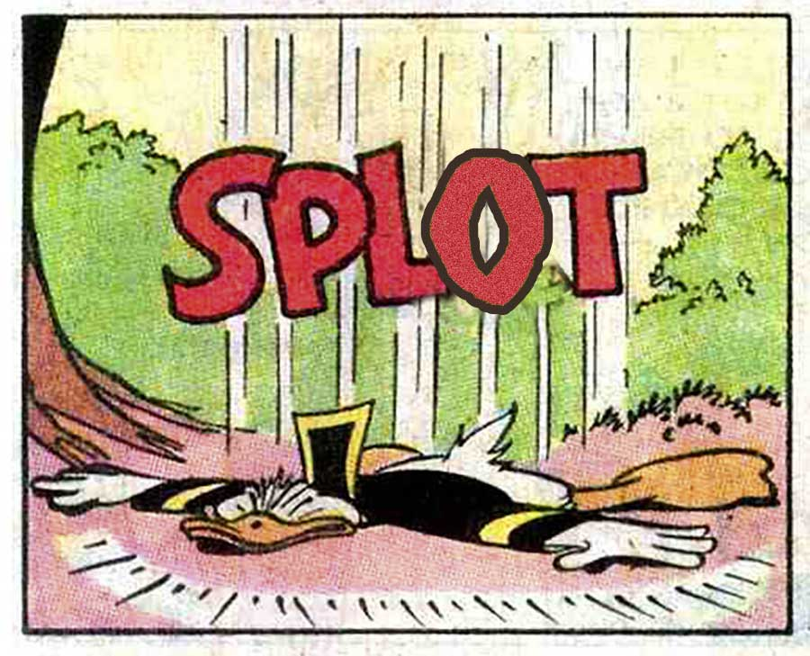

# SPLOT Lab

A place for experimenting with web-based SPLOTs or things that interact with them. [Whatsa SPLOT?](http://splot.ca/) You had to ask!

by Alan Levine https://cog.dog @cogdog

## What's Up, Docs?

I am also placing here general documentation for SPLOTs, so they can also be rendered via [Docsify This](https://docsify-this.net/). Stay tuned...

## In the Experimental Wing

* [Inspire Me With a Random SPLOT image](https://cogdog.github.io/splotlab/randysplot/) - uses WordPress API to fetch a random image from the [TRU Collector demo site](http://splot.ca/collector)
* [Glitch a Random SPLOT image](https://cogdog.github.io/splotlab/glitchsplot/) - applies glitch effect to uses  random image fetched via WordPress API from the [TRU Collector demo site](http://splot.ca/collector)

-----
*If this kind of stuff has any value to you, please consider supporting me so I can do more!*

 

