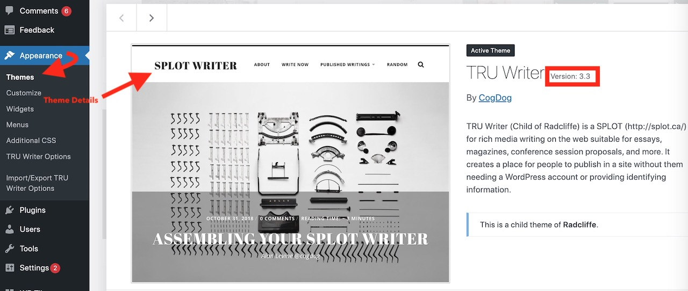
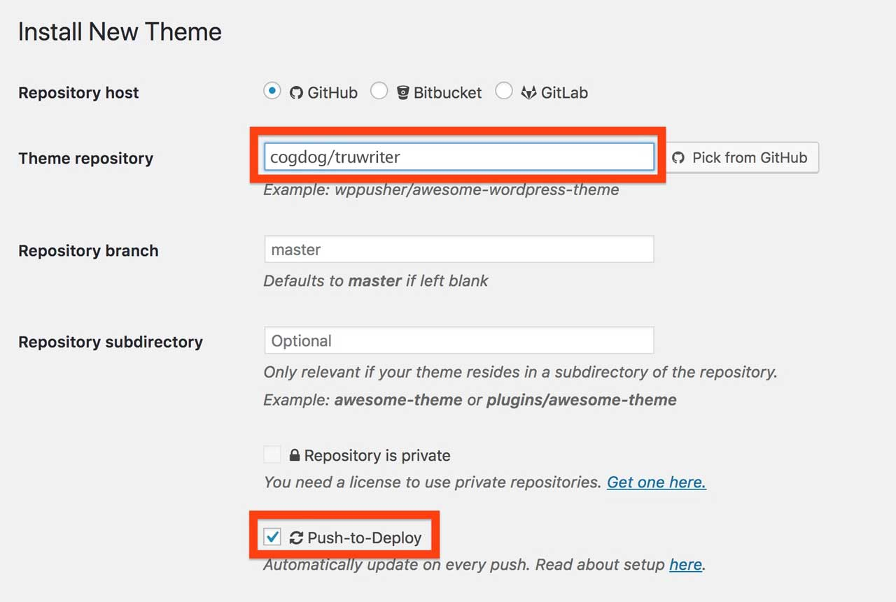
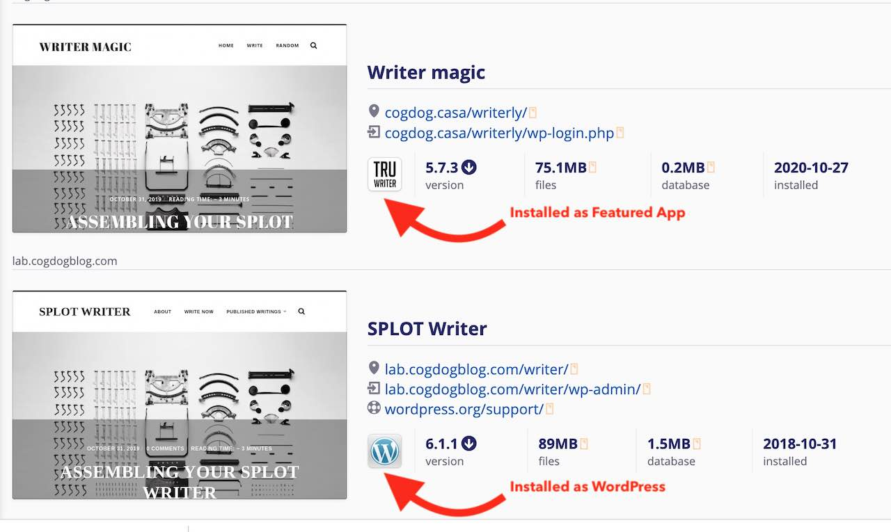
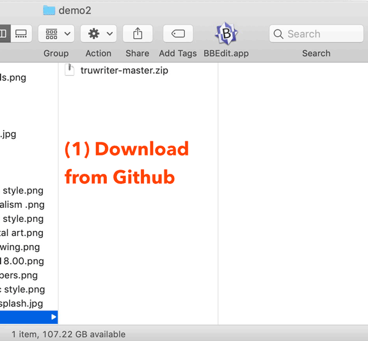
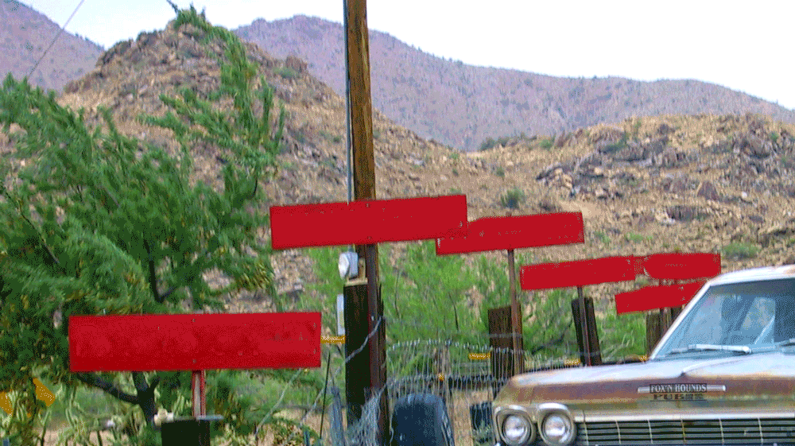

# WordPress SPLOT Guide

Alan Levine https://cog.dog • SPLOT https://splot.ca

This documentation provides general information for installing, updating, and tending to the [WordPress-based SPLOTs](https://splot.ca/category/splots/wordpress/). While each one includes its own set of specific documentation this is aimed as a general reference and also some key information for the versions previously set up via the Reclaim Hosting application installers.

Even if it sounds complicated, taking control of your SPLOTs empowers you!

 

*SPLOT control panel by Alan Levine based on [2007.06.17 – 115 Gdynia G?ówna, ET22-681 cockpit](https://flickr.com/photos/faxepl/561241356) flickr image by [faxepl](https://flickr.com/people/faxepl) shared under a [Creative Commons (BY-SA) license](https://creativecommons.org/licenses/by-sa/2.0/) modified by inserting SPLOT logo and cropping, shared here CC BY-SA.*

## Meet The SPLOTs

Each WordPress SPLOT is found on Github where you will find general information, a set of examples of other sites using that SPLOT, installation instructions, and detailed documentation on settings, customizations, and update instructions. A github account is not required to download a SPLOT theme (but is handy to have for asking question in the discussion forums posting issues)

Learn more via the links to Github or view a more friendly formatted version for each SPLOT (via Docsify This).

* TRU Writer [Github](https://github.com/cogdog/truwriter) | [Docsify This](https://docsify-this.net/?basePath=https://raw.githubusercontent.com/cogdog/truwriter/master&sidebar=true#/?id=tru-writer-wordpress-theme)
* TRU Collector [Github](https://github.com/cogdog/tru-collector) | [Docsify This](https://docsify-this.net/?basePath=https://raw.githubusercontent.com/cogdog/tru-collector/master&sidebar=true#/)
* SPLOTbox [Github](https://github.com/cogdog/splotbox)| [Docsify This](https://docsify-this.net/?basePath=https://raw.githubusercontent.com/cogdog/splotbox/master&sidebar=true#/)
* SPLOTpoint [Github](https://github.com/cogdog/splotpoint)| [Docsify This](https://docsify-this.net/?basePath=https://raw.githubusercontent.com/cogdog/splotpoint/master&sidebar=true#/)
* Daily Blank [Github](https://github.com/cogdog/dailyblank)| [Docsify This](https://docsify-this.net/?basePath=https://raw.githubusercontent.com/cogdog/dailyblank/master&sidebar=true#/)
* DS106 Assignment Bank [Github](https://github.com/cogdog/ds106bank)| [Docsify This](https://docsify-this.net/?basePath=https://raw.githubusercontent.com/cogdog/ds106bank/master&sidebar=true#/)

## Requirements

Creating a WordPress SPLOT requires a self-hosted Wordpress site (the kind that you download or install from [wordpress.org](http://www.wordpress.org). Knowledge of WordPress concepts of pages vs posts, menus, categories, tags, the Customizer will go a long way but is not critical-- but find a friend or colleague to help.

You cannot use a SPLOT theme on a free "wordpress.com" site-- it is possible there with a paid business plan. One example I know of is the [Glendale Community College Center for Teaching, Learning, & Engagement](https://gccazctle.com/) running the SPLOTbox theme. 

Any web host will do, but I most highly recommend [Reclaim Hosting](https://reclaimhosting.com/) if you need to set up your own hosting space. They are awesome.

You will first need to create a new empty Hello World WordPress site.

## Start With the Parent theme
Each WordPress SPLOT requires a different "parent" theme that provides the basic structure and presentation for your SPLOT. For example,  TRU Collector requires the Fukasawa theme and SPLOTbox requires one called Garfunkel (full detail are provided in each SPLOT's installation instructions).

Install the specified parent theme within the Wordpress Dashboard under **Appearance** -- **Themes** searching on the theme name. You do not need to activate it, the parent theme merely needs to be present.

Each SPLOT theme is a "child" that adds extra functionality and formatting to provide the SPLOT capability. Next are two ways to install a SPLOT theme.

## Manual Installation

 

*SPLOT stick shift by Alan Levine based on [Stick Shift [Transportation]](https://flickr.com/photos/trustypics/42866781801) flickr image by [trustypics](https://flickr.com/people/trustypics) shared under a [Creative Commons (BY-NC) license](https://creativecommons.org/licenses/by-nc/2.0/) modified by inserting SPLOT logo and cropping, shared here CC BY-NC*

Don't be daunted by the word "manual" --think of it like driving a car with a stick shift, once you have mastered the clutch, it becomes second nature! And then you feel more in charge of the machine.

Each SPLOT site offers a link to download the entire theme in `.zip` file format to a computer. You do not need to open or expand it, just have it handy.

The zip can be uploaded directly to your site via **Themes** (under **Appearance**) in the Wordpress dashboard, then click **Add Theme** and finally **Upload Theme**. Once uploaded, you can activate the theme and your SPLOT is ready for you to start making your own.

There will be more things to set up via the SPLOT's theme options and/or the WordPress Customizer. Refer to each theme's documentation for full details (the latest documentation is always available in the SPLOT theme's options).

You are all done!

### Updating a Manually Installed SPLOT

I am regularly updating SPLOTs to address bugs, issues, but more often to add features. I pledge to never add something that will break a previously set up site, but also keep in mind that I am not a professional programmer!

*Note that WordPress's reporting of themes being up to date does **not** reflect uploaded ones  as SPLOTs*. The way you can check is to first note the version of the theme you currently have in use. Find the active SPLOT theme in your Dashboard via  **Appearance** then  **Themes**. Hover over that theme and click the  **Theme Details** button. Note the version number of the SPLOT theme on your site.

 

Then visit the Github home for your SPLOT and look for what it lists as the current version. If the version on GitHub is a higher number, you may choose to update your SPLOT. It is not urgent to frequently update, but is worth checking, maybe every year.

How complex is it to manually update? Not complex at all! You update a SPLOT theme the exact way you originally installed it. Just download the `.zip` file for new version, and then in your dashboard, go to **Themes** (under **Appearence**). then click **Add Theme** and finally **Upload Theme**. Select the new `.zip` version of your SPLOT theme. Once uploaded you will be asked to confirm updating the theme with the newer version.  

When done, your site should report this new version on your own SPLOT site.

## WP-Pusher Installation

If all this manual download/upload of `.zip` files sounds like a hassle, then allow me, like a car salesman, offer you a one click alternative... and it can even be set up o automatically update your SPLOT themes. If this sounds too good to pass up, then I recommend trying the [WP Pusher plugin](https://wppusher.com/) which makes it easy to install themes and plugins that are published in GitHub.

To use WP-Pusher you will need to have or create an account on [GitHub](https://github.com/) (free). Log in. 

Next [download WP Pusher plugin](https://wppusher.com/download) as a ZIP file. From the plugins area of your Wordpress dashboard, click the **Upload Plugin** button, select that zip file to upload, and activate the plugin.

Then click the **WP Pusher** link in your Wordpress Dashboard, and then click the **GitHub** tab. Next, click the **Obtain a GitHub Token** button to get an authentication token. Copy the one that is generated, paste into the field for it, and finally, click **Save GitHub** Token.

Now you are ready to install a SPLOT directly, without any downloads/uploads. Under **WP Pusher** look for Install New Theme. These are the settings used to install TRU Writer, refer to any other SPLOT theme installation instructions for it's settings.

In the form that appears, under **Theme Repository**, enter `cogdog/truwriter`. If you check,the the option for **Push-to-Deploy** your SPLOT theme will be updated automatically when there is a new version in GitHub. 

Finally, click **Install Theme**.

Be amazed! 

## Updating Reclaim Hosting' Custom Installed SPLOTs

This applies only to those who previously set up TRU Collector or TRU Writer sites with the installers offered to [Reclaim Hosting](https://reclaimhosting.com/) clients as Featured Applications... if you are creating a *new* SPLOT site [please use the  intructions above](#manual-installation).

I deeply appreciate the support of Reclaim Hosting in creating these custom application installers that not only set up SPLOT sites, but also added suggested plugins and provided sample starting content. It also enabled periodic automatic theme updates. 

While making setting up a new SPLOT easy, [as announced by Reclaim Hosting on November 21, 2020](https://www.reclaimhosting.com/friendly-reminder-about-custom-installers/), for a number of reasons these are no longer available.

### How To Identify a Featured App SPLOT

In your Reclaim Hosting cpanel, look under **Applications** for **My Apps** where you will find everything in your hosting package you have installed.

A typical WordPress app will be listed showing the regular blue W of the WordPress icon, but a TRU Collector or TRU Writer site installed as a custom application will have a black and white icon featuring the name of the SPLOT. 

Also, a standard WordPress site will list a link to `wordpress.org/support`. If you see any of your sites identified by a Featured App icon, here is how you can update at any time.

Do not worry! Because of this change from Reclaim Hosting, nothing will happen to your SPLOT.

### Updating a Featured App SPLOT

You will have to follow [the manual update instructions above](#updating-a-manually-installed-splot), where you must download a new version of the SPLOT theme from GitHub, and upload it as a new theme.

**But you have to make one adjustment first**, because for say the TRU Writer theme WordPress is expecting the theme stored in a directory named, for example, `truwriter` and unfortunately GitHub provides it in a directory named `truwriter-master` downloaded as `truwriter-master.zip`. This is a zip "dance" you will have to do:

1. Download the new version of the theme from Github saved to your computer as `splotname-master.zip`
2. Expand/decompress the archive into all of its contents. 
3. Change the name of the top level directory from `splotname-master` to `splotname`
4. Re-compress the enture theme directory as `splotname.zip`

This is the file you should upload as a theme--see [steps above for "Updating a Manually Installed SPLOT"]([the manual update instructions above](#updating-a-manually-installed-splot)).

Yes, this is a bit tedious (and there might be easier ways to change the `.zip`), but, again, like learning to drive a manual transmission it may be awkward the first time, but then you can do it more naturally AND feel the pride of being in sync with your motor (yes, the author, has milked the metaphor too far!)

## If You Need help

Do not spin your wheels too much! You can make use of the Reclaim Hosting support, ask in their [community space](https://community.reclaimhosting.com), and you can always ask @cogdog via his contacts shared in each theme ir the discussion spaces provided in each Github SPLOT space.

See you out on the SPLOT roadways!

 

